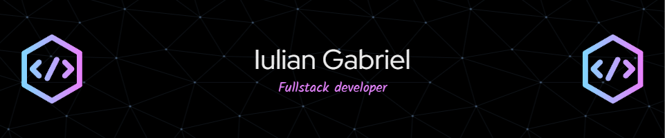

<h1 align="center">⭐About Me⭐</h1>

<h2 align="center">📚Languages and Tools i have used and learned📚</h2>

  
  &nbsp;
  
  &nbsp;
  
  &nbsp;
  
  &nbsp;
  
  &nbsp;
  
  &nbsp;
  
  &nbsp;
  
  
  <h2 align="center">📊Stats📊</h2>

  
  
  

  
